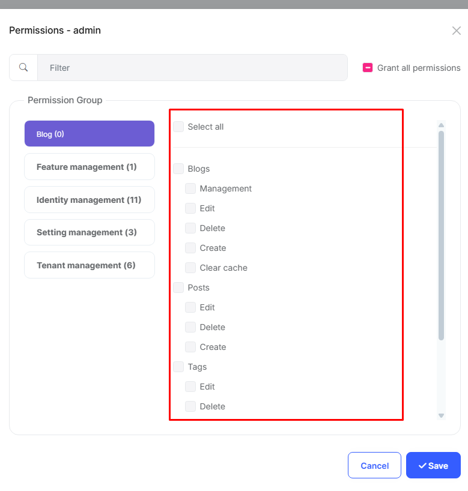

# Installation Notes for Blogging Module

The ABP Blogging module provides a simple blogging system for ABP applications. It allows you to create and manage blogs, posts, tags, and comments. The module includes both a public interface for readers and an admin interface for content management.

Key features of the Blogging module:
- Multiple blog support
- Post management with rich text editing
- Commenting functionality
- Social media sharing
- Admin interface for content management

## Required Configurations

The Blogging module requires **permission** settings to be configured after installation. Ensure that the necessary roles have the appropriate access rights for managing blogs, posts, comments and others.

### Update Database

The Blogging module requires database migrations to be applied. Following installation, you must update the database to create the necessary tables.

### Permissions

Enable the following permissions for the roles that require access to the Blogging module:

## Documentation

For detailed information and usage instructions, please visit the [Blogging Module documentation](https://abp.io/docs/latest/Modules/Cms-Kit/Blogging). 